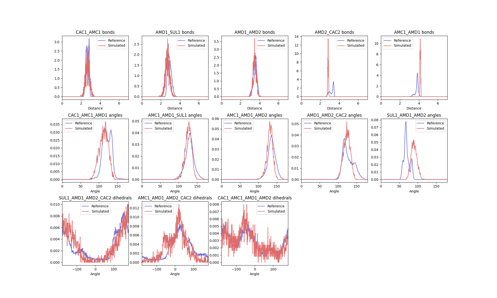
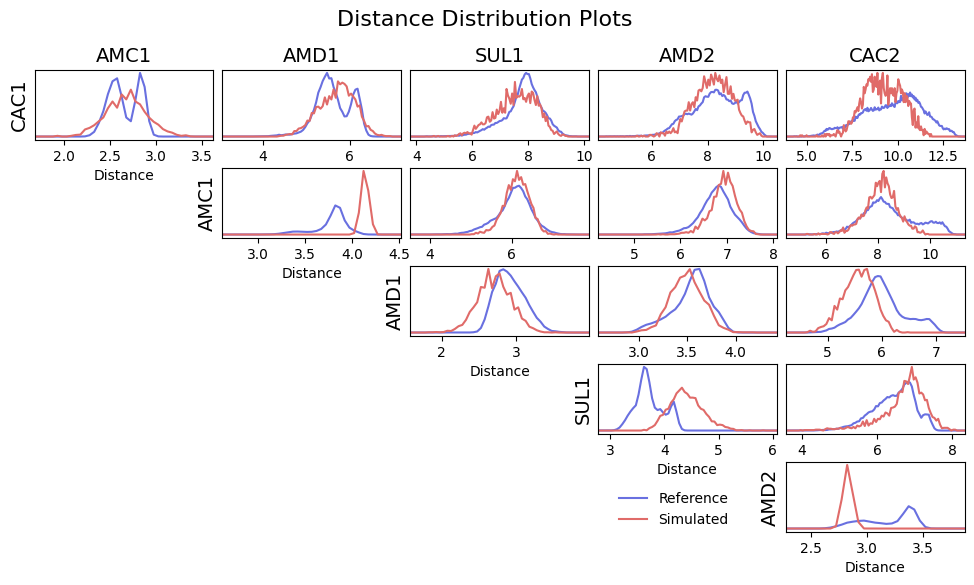
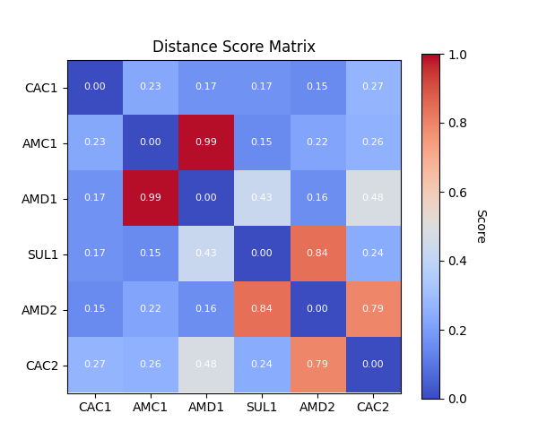

``ff_assess``
**************

As previously indicated, ``ff_assess`` is a powerful tool to help assess a new
CG model's validity against a reference simulation.

Prepared simulations of the GSH model are found in the `<data/assessment <https://github.com/Martini-Force-Field-Initiative/fast_forward/tree/main/fast_forward/tests/data/GSH/assessment>`_
folder of the example directory, if you have not conducted your own simulation.

Assuming something like the following directory structure, we can run ``ff_assess`` using the
command below

.. code-block::

    .
    ├── assessment
    ├── atomistic
    │   ├── frame.gro
    │   ├── topol.tpr
    │   └── traj.xtc
    ├── first_simulation
    │   ├── GSH.itp -> mapping_and_interactions/GSH.itp
    │   ├── production.gro
    │   ├── production.tpr
    │   └── production.xtc
    └── mapping_and_interactions
        ├── GSH.itp
        ├── inter1.dat
        ├── inter1_distr.dat
        ├── inter2.dat
        ├── *.dat ...
        ├── mapped.gro
        ├── mapped.tpr
        └── mapped.xtc

Running ``ff_assess`` from the assessment directory:

.. code-block::

    ff_assess -f simulated.xtc -s simulated.tpr -i ../first_simulation/GSH.itp -d ../mapping_and_interactions/ -plots

Upon successful completion, the program will generate several comparison figures and scoring reports.

Interaction assessment
======================

The first comparison that ``ff_assess`` makes is between bonded distributions as annotated in the molecular
topology. This results in a figure comparing the two distributions:

As well as a report with the scoring function:

.. code-block::

     [ Interaction Distribution Report ]
       Overall Score : 0.39 ± 0.08

     Interaction Scores:
     0 - identical, 1 - no overlap

     Score guide:
       0.0-0.3 : good
       0.3-0.5 : ok
       0.5-1.0 : bad

            Hellinger distance (Scoring function)

     bonds
        CAC1_AMC1           : 0.33 (0.25)
        AMD1_SUL1           : 0.41 (0.45)
        AMD1_AMD2           : 0.20 (0.17)
     ...

As described above, the report contains both the Hellinger distance and the modified scoring function scores
for each distribution annotated. Similar to ``ff_inter``, the ``-plot-data`` flag can be used for the subprogram to
also write out the raw data for the plots so that it can be replotted as desired. The report and plots can be
used to indicate where further optimisation of the model could be targeted. The overall score, calculated as the
mean of all the individual scores, could be used to report a single value for the fidelity of the model.

Distance distribution assessment
================================

To ensure good conformational sampling by the new model, ``ff_assess`` also generates distribution comparisons for
intramolecular distances in the newly simulated trajectory against their references. Distance scoring can be used
to indicate where interactions are missing from the model. In further optimisation, these interactions could be
introduced to better reproduce the molecular conformational ensemble. Where constraints are present in the system
(as in the AMD1-AMC1 bead distance shown below), this may result in distance distributions that are not possible to
resolve, and therefore result in high scores. For this reason, distances between constraints are normally excluded
from the overall score reported at the top of the written report. To include them, the ``-include-constraints``
flag can be used.

As before, a distribution comparison figure is generated, comparing the reference intramolecular distances to
the newly simulated ones:

The modified scoring function only is used to generate a scoring matrix:

The scoring matrix is also saved as a report:

.. code-block::

     [ Distance Distribution Report for GSH ]
      Overall Score : 0.37 ± 0.05

       Max Score : 0.99

     Score guide:
       0.0-0.3 : good
       0.3-0.5 : ok
       0.5-1.0 : bad

       Score Matrix:
     0 - identical, 1 - no overlap

           CAC1  AMC1  AMD1  SUL1  AMD2  CAC2
     CAC1  0.00  0.23  0.17  0.17  0.15  0.27
     AMC1  0.23  0.00  0.99  0.15  0.22  0.26
     AMD1  0.17  0.99  0.00  0.43  0.16  0.48
     SUL1  0.17  0.15  0.43  0.00  0.84  0.24
     AMD2  0.15  0.22  0.16  0.84  0.00  0.79
     CAC2  0.27  0.26  0.48  0.24  0.79  0.00

