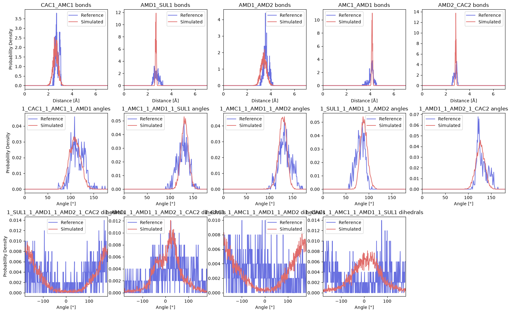
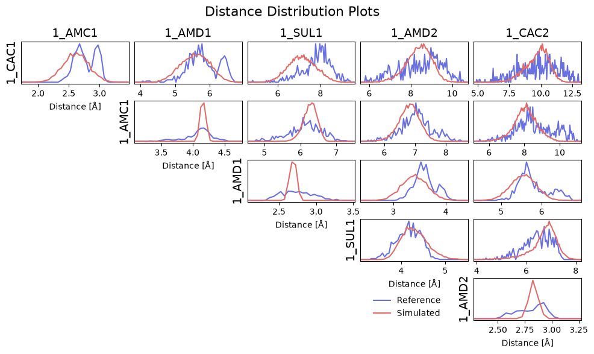
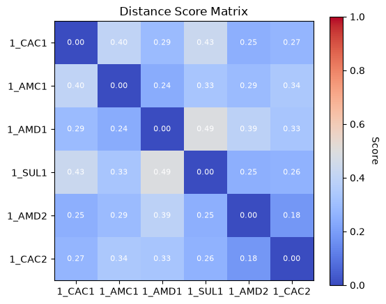

``ff_assess``
**************

As previously indicated, ``ff_assess`` is a powerful tool to help assess a new
CG model's validity against a reference simulation. This tutorial follows from
the :doc:`ff_inter_tutorial` tutorial

Prepared simulations of the GSH model are found in the `assessment <https://github.com/Martini-Force-Field-Initiative/fast_forward/tree/main/examples/GSH/assessment>`_
folder of the example directory, if you have not conducted your own simulation.

Assuming something like the following directory structure, we can run ``ff_assess`` using the
commands below. Generally speaking, ``ff_assess`` should be used following an initial simulation with the parameters
generated by ``ff_inter``, or another such similar program.

.. code-block::

    .
    ├── assessment
    ├── atomistic
    │   ├── frame.gro
    │   ├── topol.tpr
    │   └── traj.xtc
    ├── first_simulation
    │   ├── GSH.itp -> mapping_and_interactions/GSH.itp
    │   ├── production.gro
    │   ├── production.tpr
    │   └── production.xtc
    └── mapping_and_interactions
        ├── GSH.itp
        ├── inter1.dat          #
        ├── inter1_distr.dat    # .dat files generated by ff_inter
        ├── inter2.dat          #
        ├── *.dat ...           #
        ├── mapped.gro
        ├── mapped.tpr
        └── mapped.xtc

Running ``ff_assess`` from the assessment directory:

.. code-block::

    ff_assess -f simulated.xtc -s simulated.tpr -i ../first_simulation/GSH.itp -d ../mapping_and_interactions/ -plots -plot-data

Upon successful completion, the program will generate several comparison figures and scoring reports.

Interaction assessment
======================

The first comparison that ``ff_assess`` makes is between bonded distributions as annotated in the molecular
topology. This results in a figure comparing the two distributions:

As well as a report with the scoring function:

.. code-block::

     [ Interaction Distribution Report ]
       Overall Score : 0.368 ± 0.0234

     Interaction Scores:
     0 - identical, 1 - no overlap

     Score guide:
       0.0-0.3 : good
       0.3-0.5 : ok
       0.5-1.0 : bad

            Hellinger distance (Scoring function)

     bonds
        CAC1_AMC1           : 0.42 (0.44)
        AMD1_SUL1           : 0.66 (0.50)
        AMD1_AMD2           : 0.40 (0.43)
     ...

As described above, the report contains both the Hellinger distance and the modified scoring function scores
for each distribution annotated. Similar to ``ff_inter``, the ``-plot-data`` flag can be used for the subprogram to
also write out the raw data for the plots so that it can be replotted as desired. The report and plots can be
used to indicate where further optimisation of the model could be targeted. The overall score, calculated as the
mean of all the individual scores, should be used to report a single value for the fidelity of the model.

Distance distribution assessment
================================

To ensure good conformational sampling by the new model, ``ff_assess`` also generates distribution comparisons for
intramolecular distances in the newly simulated trajectory against their references. Distance scoring can be used
to indicate where interactions are missing from the model. In further optimisation, these interactions could be
introduced to better reproduce the molecular conformational ensemble. Where constraints are present in the system,
this may result in distance distributions that are not possible to resolve, and therefore result in high scores.
For this reason, distances between constraints are weighted down when calculating the overall score reported at
the top of the written report. To weight them the same as other, unconstrained, distances, the
``-include-constraints`` flag can be used.

.. note::

    This section relies on the ``*_distances_distr.dat`` reference files, which ``ff_inter`` only writes out
    when run with ``-dist-matrix`` (see the :doc:`ff_inter_tutorial` tutorial), since computing every pairwise
    distance in a molecule can be expensive for larger systems. If none of these reference files are present,
    ``ff_assess`` skips this section automatically with a warning and still completes the interaction
    assessment above. To skip it deliberately, for example while quickly iterating on interaction fitting,
    pass ``-interactions-only``.

As before, a distribution comparison figure is generated, comparing the reference intramolecular distances to
the newly simulated ones:

The modified scoring function only is used to generate a scoring matrix:

The scoring matrix is also saved as a report:

.. code-block::

     [ Distance Distribution Report for GSH ]
      Overall Score : 0.316 ± 0.0149

       Max Score : 0.49

     Score guide:
       0.0-0.3 : good
       0.3-0.5 : ok
       0.5-1.0 : bad

       Score Matrix:
     0 - identical, 1 - no overlap

          1_CAC1 1_AMC1 1_AMD1 1_SUL1 1_AMD2 1_CAC2
    1_CAC1  0.00  0.40  0.29  0.43  0.25  0.27
    1_AMC1  0.40  0.00  0.24  0.33  0.29  0.34
    1_AMD1  0.29  0.24  0.00  0.49  0.39  0.33
    1_SUL1  0.43  0.33  0.49  0.00  0.25  0.26
    1_AMD2  0.25  0.29  0.39  0.25  0.00  0.18
    1_CAC2  0.27  0.34  0.33  0.26  0.18  0.00

