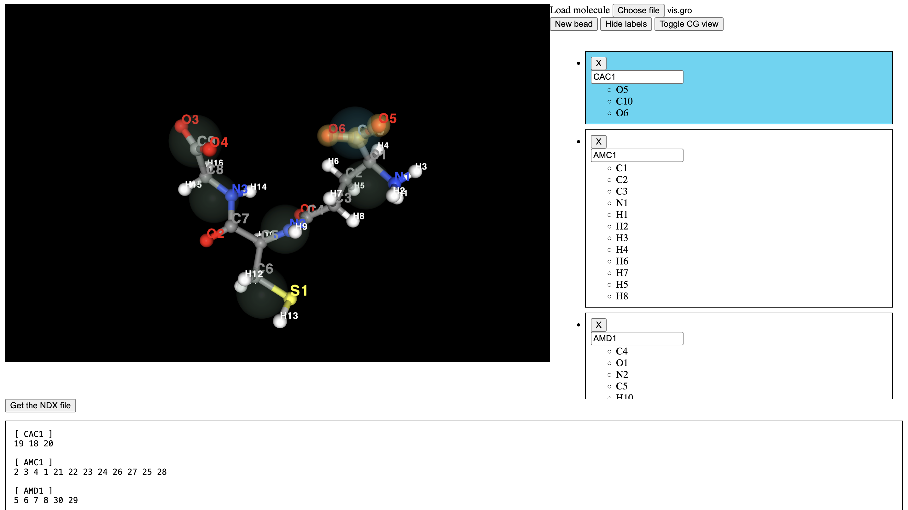
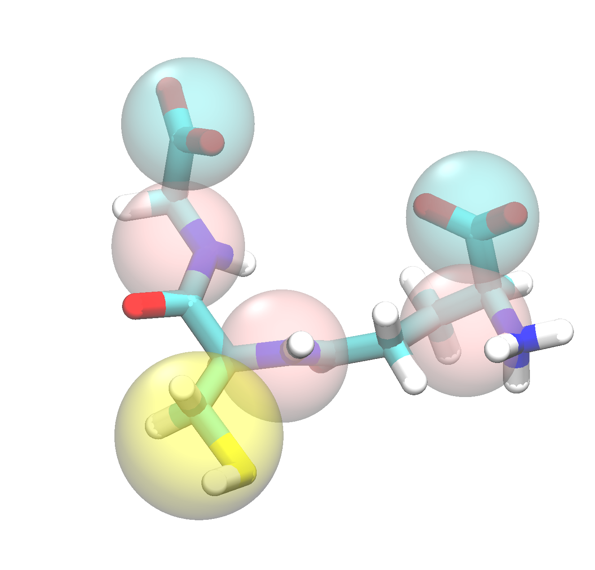

``ff_map``
***********

The ``ff_map`` subprogram takes a trajectory at a higher resolution (such as atomistic),
and converts it to a trajectory at a lower resolution (such as coarse-grained Martini).
The resultant trajectory is known as a `pseudo-atomistic` one, as it represents the position of
the beads as if they exactly replicated an atomistic conformation.

System preparation
===================

We start with an atomistic trajectory of the peptide-like molecule, GSH, performed using the Charmm36
force field. After running a full production trajectory, the trajectory has been stripped of its
solvent, and centered. Mapping solvent molecules is not currently possible for ``ff_map``, so this is an
essential step in preparing your system. Such a processing could be performed using the following Gromacs commands:

.. code-block::

    # process the trajectory
    gmx trjconv -f prod.xtc -s prod.tpr -pbc mol -center -o vis.gro -e 0
    gmx trjconv -f prod.xtc -s prod.tpr -pbc mol -center -o vis.xtc

    # make a topology file to use with fast-forward
    head -n -3 topol.top > vis.top
    gmx grompp -f mdout.mdp -p vis.top -c vis.gro -o vis.tpr

The files in the `data/AA <https://github.com/Martini-Force-Field-Initiative/fast_forward/tree/main/fast_forward/tests/data/AA>`_
subfolder called ``atomistic.gro``, ``atomistic.xtc`` and ``atomsitic.tpr`` are readily prepared solvent-free atomistic coordinate,
trajectory and topology files for use for the rest of this tutorial.

Preparing the map file
=======================

The solvent free map file can now be used to prepare a map file using the `cgbuilder <https://jbarnoud.github.io/cgbuilder/>`_
tool. The file can be uploaded, and beads assigned to atoms by clicking on the interactive visualisation pane.

The .map file can be downloaded further down the page, or the example file in the data directory can be used.

A small modification required is the header directive, which must be changed to the following:

.. code-block::

    [ molecule ]
    LIG GSH

Here, the ``molecule`` directive indicates the name of the molecule in the topology file at atomistic resolution (``LIG``)
and the name at CG resolution (``GSH``).

Mapping the molecule
====================

With the `.map` file prepared, we can map the system. The trajectory can be mapped simply with:

.. code-block::

    ff_map -f atomistic.xtc -s atomistic.tpr -m GSH.map -o mapped.xtc -mols LIG

Note that by mapping a trajectory, the first frame is written as a simple coordinate file (``.gro``) also
with the same file name prefix (in this case, it will be called ``mapped.gro``).

The mapped structure could now be viewed in vmd to check that everything is now in place:

The tutorial folder `data/CG <https://github.com/Martini-Force-Field-Initiative/fast_forward/tree/main/fast_forward/tests/data/GSH/CG>`_
contains the mapped first frame and trajectory.

From here, the mapped trajectory can be used in the ``ff_inter`` subprogram to generate
initial parameters for the molecule.

